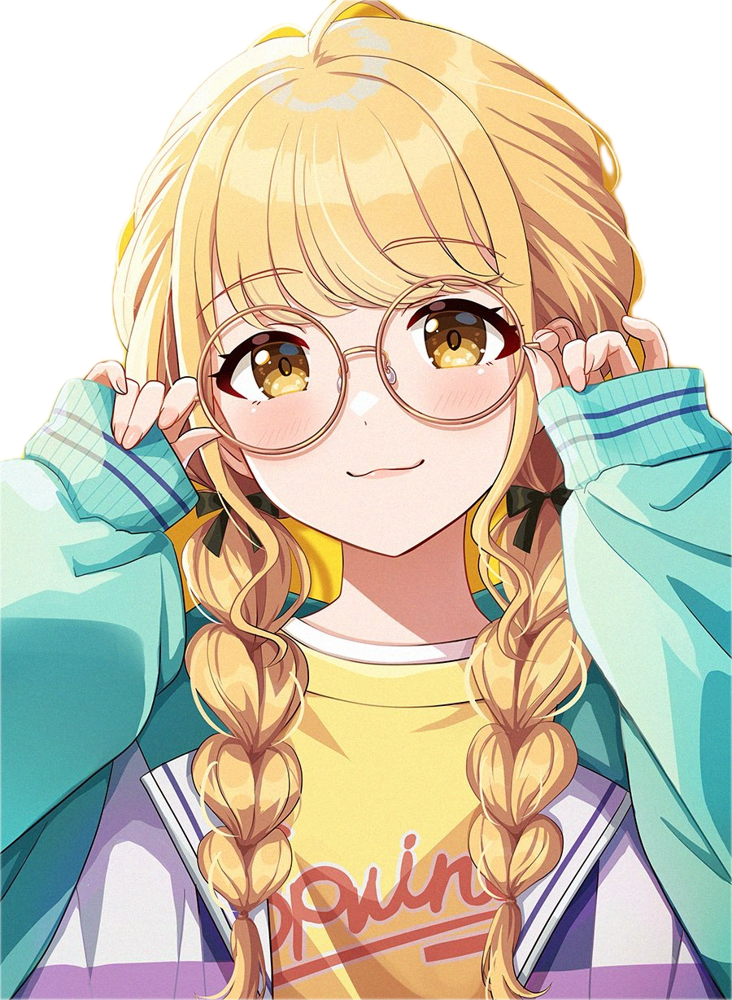

  
 

# 
  

  

## 💫 About Me

- 🎓 Junior @ [SUSTech](https://www.sustech.edu.cn/en/) (Southern University of Science and Technology)
- 👾 Anime fan - Love **Anya** from Spy x Family
- 🎮 Gaming enthusiast - Main **Zed** in League of Legends & enjoy VALORANT
- 🐉 Nailoong lover 😈
- 💼 Selected for **ByteDance 2025 Spring ByteIntern** program!

## 🚀 Tech Stack

  
  
  
  
  
  

  
  
  

  

## 📊 GitHub Stats

  

  

  

  

  
  ## 💖 Let's Connect!
  
  
  
  
  

  ⭐ From [we-are-Zed](https://github.com/we-are-Zed) with ❤️

